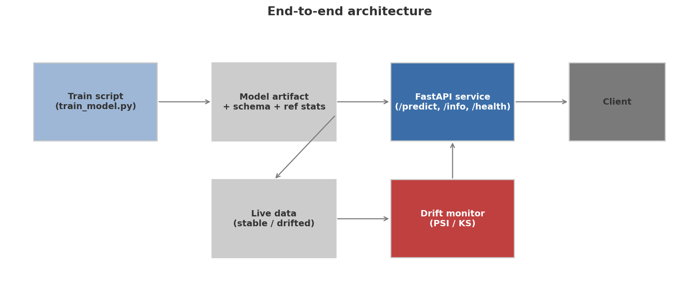
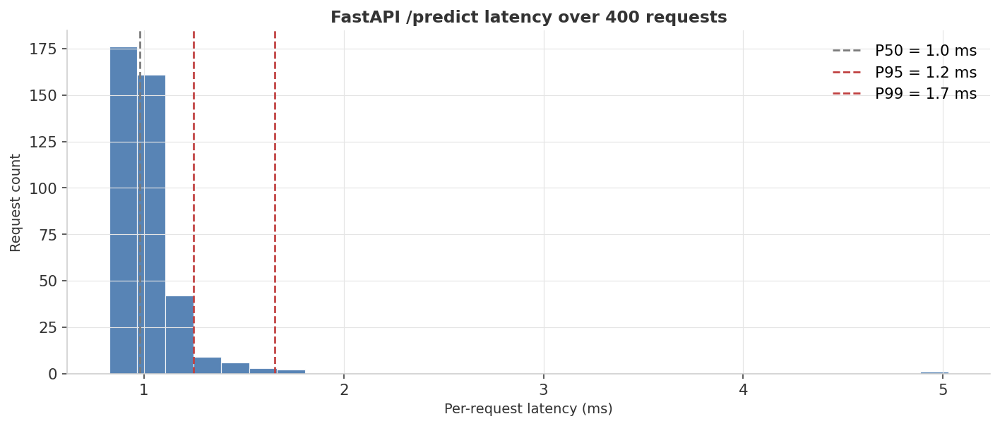
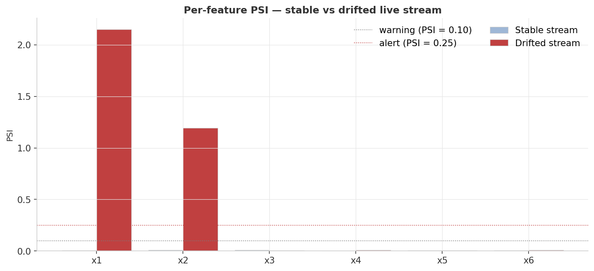
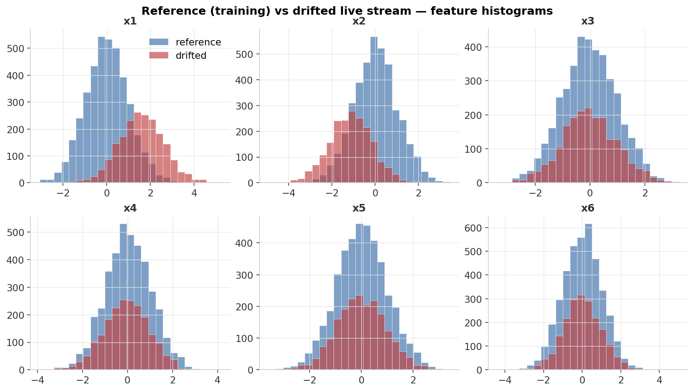

<div align="center">

# MLOps — Deploy a Model and Watch It Drift

**Train a classifier, serve it as a FastAPI service, load-test it, then catch a synthetic data drift with PSI.**


</div>

---

## At a glance

> A miniature production-shaped pipeline: train → persist → serve → load-test → monitor for drift. Each stage is small enough to fit in one file, and the entire run is `python run_dashboard.py`.

<table>
<tr>
<td align="center" width="33%">
<sub>Test AUC</sub><br>
<b style="font-size:1.6em; color:#3B6EA8;">0.986</b><br>
<sub>GradientBoosting on synthetic data</sub>
</td>
<td align="center" width="33%">
<sub>p99 latency</sub><br>
<b style="font-size:1.6em; color:#3B6EA8;">1.65 ms</b><br>
<sub>per /predict request, in-process</sub>
</td>
<td align="center" width="33%">
<sub>Drift PSI on x1</sub><br>
<b style="font-size:1.6em; color:#C04040;">2.15</b><br>
<sub>(threshold 0.25 — strong alert)</sub>
</td>
</tr>
</table>

| Stage | What we're measuring | Headline number |
|---|---|---|
| Train | Test accuracy / AUC of the classifier | **acc 0.940, AUC 0.986** |
| Serve | p50 / p95 / p99 latency of `/predict` over 400 requests | **0.98 / 1.25 / 1.65 ms** |
| Monitor (stable stream) | PSI per feature, no drift expected | **all PSI < 0.01** ✅ |
| Monitor (drifted stream) | PSI per feature, drift injected on x1 and x2 | **x1 = 2.15, x2 = 1.19** 🚨 |

<sub>**Headline finding:** the *shape* of production ML — a model artifact that ships with its schema and reference statistics, an HTTP service that validates inputs, and a monitor that compares each live batch's distribution to training — is small. Less than 400 lines of Python total. The discipline is in *enforcing* that shape, not in the algorithms.</sub>

---

## Experimental setup

Everything below is fixed by `seed = 42` and reproduces on any machine with the pinned library versions.

### Data-generating process

All data is synthetic and produced by `generate_data.py` using a seeded NumPy generator (`np.random.default_rng(42)`). The generative model is deliberately non-linear so a plain linear classifier wouldn't saturate it:

$$y = \mathbf{1}[x_1 + x_2 \cdot x_3 > 0]$$

Six i.i.d. standard-normal features: `x1`–`x6 ~ 𝒩(0, 1)`. The target is fully determined by this rule — no label noise is added.

Four splits are drawn from the same generator in sequence, so they are statistically independent:

| Split | Rows | Notes |
|---|---|---|
| Train | 4 000 | Used to fit the classifier and compute reference statistics. |
| Test | 1 000 | Held out; accuracy and AUC reported here. |
| Live — stable | 2 000 | Same distribution as train; PSI should be near zero. |
| Live — drifted | 2 000 | Two features shifted (see below); drift monitor should alert. |

**Drift injection.** The drifted live stream is generated by the same `_make_xy` function with `drift=True`:

| Feature | Shift | Magnitude |
|---|---|---|
| x1 | mean += 1.6 | +1.6 σ |
| x2 | mean −= 1.12 | −1.12 σ (= 1.6 × 0.7) |
| x3–x6 | none | unaffected control features |

This is a distribution shift, not a label-flip — the decision rule is unchanged, but the input space has moved. Monitoring catches it; the model itself cannot self-diagnose without a reference.

| Parameter | Value | Why it's set this way |
|---|---|---|
| `n_samples` | 4 000 | Enough rows for a stable training distribution with 6 features; PSI bins are well-populated. |
| `n_features` | 6 | Small enough that every feature is individually plotted; large enough that "which feature drifted" is non-trivial. |
| `drift_shift_size` | 1.6 σ | Large enough to push PSI far above the 0.25 alert threshold and confirm the monitor works. |
| `seed` | 42 | Single seed drives all four splits; change it and all numbers change. |

### Model & artifact bundle

**Classifier.** `sklearn.ensemble.GradientBoostingClassifier` with `n_estimators=200`, `max_depth=3`, `random_state=42`. No feature scaling applied (tree ensembles are scale-invariant).

**Persisted artifact bundle** (`models/`):

| File | Contents |
|---|---|
| `classifier.joblib` | Serialized fitted estimator (via `joblib.dump`). |
| `schema.json` | Feature names, model type, training metrics, per-feature mean/std of the training distribution. |
| `reference_X.npy` | Raw training feature matrix (4 000 × 6); used by the monitor as the reference distribution for PSI/KS bins. |

The schema and reference array ship with the model. Without them the service has no contract to validate against, and the monitor has nothing to compare a live batch to.

### Latency benchmark protocol

400 requests are sent sequentially to the `/predict` endpoint via `fastapi.testclient.TestClient` (in-process, no network socket). Each request sends a single-row feature dict drawn at random from the training set. Per-request wall time is measured with `time.perf_counter()` wrapping the `client.post()` call, converted to milliseconds, and aggregated into percentiles.

Because `TestClient` calls the ASGI handler directly in the same Python process, the measured latency is the lower bound: it includes Pydantic validation, feature assembly, `predict_proba`, and Python object serialization, but excludes network I/O, TLS, and OS scheduling jitter.

### Drift-monitor protocol

`monitor.py` computes two statistics for each feature, comparing the reference array (4 000 training rows) against each live batch (2 000 rows):

**PSI** uses 10 quantile-based bins derived from the reference distribution (deciles: `np.linspace(0, 1, 11)` passed to `np.quantile`). Bin edges are set to −∞ / +∞ at the tails so all live observations fall within the bin range. A small floor of `ε = 1e-6` prevents log-of-zero.

**KS test** uses `scipy.stats.ks_2samp` for a two-sample, distribution-free test. Its statistic and p-value are recorded alongside PSI.

| Threshold | PSI value | Action |
|---|---|---|
| No significant change | < 0.10 | Keep serving. |
| Moderate shift | 0.10 – 0.25 | Investigate; don't necessarily retrain. |
| Significant shift (alert) | > 0.25 | Alert; consider retraining. |

### Environment

`python ≥ 3.10` · `numpy ≥ 1.24` · `pandas ≥ 2.0` · `scikit-learn ≥ 1.3` · `matplotlib ≥ 3.7` · `fastapi ≥ 0.110` · `uvicorn ≥ 0.30` · `pydantic ≥ 2.0` · `joblib ≥ 1.3` · `httpx ≥ 0.27` · `scipy` (required by `monitor.py`; install via `pip install scipy`).

A `Dockerfile` is provided for containerized runs. It installs requirements, runs `train_model.py` to bake the artifact into the image, then starts `uvicorn`. For local development the in-process `run_dashboard.py` path is faster and removes the port-binding step.

---

## Dashboard

### 1. End-to-end architecture



Five components, three flows:

- **Train** produces an artifact bundle: the fitted model + schema (feature names, model type, training metrics) + reference distribution statistics.
- **Serve** loads the artifact at startup and exposes `/health`, `/info`, `/predict`, `/predict/batch`. Inputs are validated against the schema; missing features return HTTP 400, not a silent NaN.
- **Monitor** compares live data batches against the reference statistics using PSI and KS — flagging the operator when the distribution shifts.

### 2. Latency profile



400 requests through the FastAPI handler (in-process via `fastapi.testclient.TestClient` so we don't depend on a port-binding step). The histogram is tight: p50 of 0.98 ms, p99 of 1.65 ms. That's the lower bound — a real server adds network latency, request parsing, and TLS — but it tells us the *model evaluation* is not the bottleneck. For a GradientBoosting model on 6 features, that's expected.

### 3. PSI — drift detection on stable vs drifted streams



Per-feature PSI on two live streams:

- **Stable stream (light blue)**: drawn from the same distribution as training. All PSIs sit well below the warning threshold of 0.10.
- **Drifted stream (red)**: same generator, but with `x1` shifted by +1.6σ and `x2` shifted by −1.1σ. PSI for x1 explodes to **2.15**, and x2 to **1.19** — both far above the alert threshold of 0.25. The unaffected features (x3–x6) stay quiet, so the alert is feature-level actionable, not just "something is wrong."

This is the operational story: a monitor that *only* fires when the data actually shifts, and tells you *which feature* shifted.

### 4. Distribution overlays — what the drift actually looks like



Reference (blue) vs drifted (red) histograms, one panel per feature. The mean shifts on x1 and x2 are visually obvious; x3–x6 sit on top of each other. Visualization isn't strictly necessary — PSI does the math — but it's the artifact you want when an alert fires and someone asks "what does that mean?"

---

## Validation methodology

This project validates on three independent axes: model quality, service performance, and drift detection. Each axis uses a different measurement lens and has different caveats.

### Axis 1 — Model quality (held-out test set)

The classifier is evaluated on 1 000 held-out rows (the "test" split drawn sequentially after train, before the live batches). Two metrics:

| Metric | Definition | Reads as |
|---|---|---|
| **Accuracy** | $\frac{1}{n}\sum \mathbf{1}[\hat{y}_i = y_i]$ | Fraction of predictions correct. Sensitive to class balance; balanced here by the symmetric decision rule. |
| **AUC** | Area under the ROC curve | Probability that the model ranks a positive example above a negative one. 1.0 = perfect separation; 0.5 = coin flip. |

The non-linear interaction ($x_1 + x_2 \cdot x_3$) makes this harder than a linearly separable problem; a GradientBoosting ensemble with 200 trees at depth 3 can approximate it closely.

### Axis 2 — Service performance (latency percentiles)

Percentiles are reported rather than the mean because the mean is sensitive to rare slow requests and tells you nothing about the worst-case caller experience. The three percentiles read as follows:

| Percentile | Meaning |
|---|---|
| **p50** | Half of requests are faster than this. The "typical" request. |
| **p95** | 1 in 20 requests exceeds this. The SLA you'd negotiate with a caller. |
| **p99** | 1 in 100 requests exceeds this. Reveals tail behavior — often dominated by GC pauses or contention. |

The benchmark uses `TestClient` (in-process), so the numbers are a **lower bound on real-server latency**. They isolate model-evaluation cost from network, OS scheduling, and TLS overhead.

### Axis 3 — Drift detection (PSI + KS)

PSI quantifies how much a current distribution has shifted from a reference. For feature $j$, with the reference binned into $K = 10$ decile-based bins:

$$\text{PSI}_j = \sum_{i=1}^{K} \left( p_i^{\text{current}} - p_i^{\text{ref}} \right) \ln\!\left( \frac{p_i^{\text{current}}}{p_i^{\text{ref}}} \right)$$

The logarithmic penalty makes PSI sensitive to both the direction and the magnitude of the shift. The industry thresholds (< 0.10 / 0.10–0.25 / > 0.25) are rules of thumb, not statistical guarantees.

KS (`scipy.stats.ks_2samp`) provides a complementary distribution-free two-sample test. Its p-value is near zero when distributions differ and near 1 when they are consistent. PSI is the operational alert signal; KS adds a second opinion.

Per-feature PSI makes the alert actionable: instead of "something is wrong," the operator sees "x1 shifted dramatically, x2 shifted moderately, x3–x6 are fine" — which maps directly to which upstream data pipelines to check.

### Full results

**Model quality** (from `train_model.py` output, stored in `models/schema.json`):

| Metric | Value |
|---|---:|
| Test accuracy | **0.940** |
| Test AUC | **0.986** |

**Latency** (from `results/metrics.json`, 400 in-process requests):

| Percentile | ms |
|---|---:|
| p50 | **0.98** |
| p95 | **1.25** |
| p99 | **1.65** |
| mean | 1.02 |
| max | 5.03 |

**Per-feature PSI** (from `results/metrics.json`):

| Feature | Stable stream PSI | Drifted stream PSI | Drifted stream KS stat |
|---|---:|---:|---:|
| x1 | 0.0076 | **2.151** 🚨 | 0.574 |
| x2 | 0.0087 | **1.193** 🚨 | 0.437 |
| x3 | 0.0080 | 0.0048 ✅ | 0.019 |
| x4 | 0.0014 | 0.0080 ✅ | 0.035 |
| x5 | 0.0068 | 0.0037 ✅ | 0.015 |
| x6 | 0.0061 | 0.0114 ✅ | 0.029 |

<sub>Exact values from `results/metrics.json`, regenerated on every `python run_dashboard.py`. Alert threshold: PSI > 0.25. All stable-stream PSIs sit below 0.009 — no false positives.</sub>

### Reproducibility

A single `seed = 42` in `DataConfig` drives all four splits (train, test, stable, drifted) through one `np.random.default_rng(42)` call; the same generator advances sequentially through all draws. Rerunning `python run_dashboard.py` produces the same numbers on the same hardware. **Latency numbers are hardware-dependent** — p99 on a loaded laptop may be 2–3× higher than on a quiet desktop; the ordering (p50 < p95 < p99) and the "model evaluation is not the bottleneck" conclusion hold regardless.

---

## What's actually happening

### The artifact, not just the model

```
models/
├── classifier.joblib       # the fitted estimator
├── schema.json             # feature names, training metrics
└── reference_X.npy         # training-set features for drift comparison
```

A *model* is a file. A *production-ready model* is a bundle: the file plus everything you need to call it correctly, plus everything you need to detect when calling it has stopped being a good idea. Without the schema, the service has no idea what fields to expect. Without the reference stats, the monitor has nothing to compare against.

### The service contract

```python
POST /predict
{
  "features": {
    "x1": 0.42, "x2": -1.10, "x3": 0.07,
    "x4": 1.30, "x5": -0.20, "x6": 0.66
  }
}
```

Pydantic validates the request shape. The handler then ensures every required feature from the schema is present (HTTP 400 if not), assembles them in the schema's declared order, and runs `predict_proba`. The full classifier path is twelve lines of code in `service.py`.

### What PSI actually measures

```
PSI = sum_i (p_i_current − p_i_ref) · log(p_i_current / p_i_ref)
```

Bin the reference distribution into deciles. For each bin, compare the fraction of *current* observations falling in that bin against the *reference* fraction. Penalize the difference logarithmically. The result is symmetric in spirit (large in either direction) and bounded only by your numerical floor.

Industry rule of thumb:

| PSI | Meaning |
|---|---|
| < 0.10 | No significant change — keep serving. |
| 0.10 – 0.25 | Moderate shift — investigate, don't necessarily retrain. |
| > 0.25 | Significant shift — alert, consider retraining. |

We pair it with the Kolmogorov–Smirnov two-sample test (`scipy.stats.ks_2samp`) for a complementary p-value-flavored perspective.

### What's deliberately not in scope

- Real Kubernetes / cloud deploy. Would distract from the operational shape.
- ML feature flags, A/B between models. One model, one path.
- Online retraining. Drift is detected, not auto-corrected.
- A model registry beyond joblib + schema.json. Plenty for one model; you'd reach for MLflow at 10+.

The goal of this project is "I understand the shape of production ML and can implement it from scratch." Not "I have rebuilt SageMaker."

---

## Reproduce

### Quick (no Docker, all in-process)

```bash
python3 -m venv .venv && source .venv/bin/activate
pip install -r requirements.txt
python run_dashboard.py    # train + serve in-process + load-test + drift report + figs
```

Wall-time ~5 seconds. All four dashboard PNGs land in `assets/` and the metrics summary in `results/metrics.json`.

### Real service

```bash
python train_model.py
uvicorn service:app --port 8000 --reload
# then:
curl http://localhost:8000/health
curl http://localhost:8000/info
curl -X POST http://localhost:8000/predict \
     -H "Content-Type: application/json" \
     -d '{"features":{"x1":0.4,"x2":-1.1,"x3":0.07,"x4":1.3,"x5":-0.2,"x6":0.66}}'
```

### Containerized

```bash
docker build -t ml-09-classifier .
docker run -p 8000:8000 ml-09-classifier
```

The Dockerfile is intentionally simple: install requirements, train so the artifact is baked into the image, then start uvicorn. A real one would split build/run, use a non-root user, and pull the model from a registry rather than training during build.

---

## Project layout

```
09-mlops-deploy/
├── README.md              ← this dashboard
├── requirements.txt
├── Dockerfile             ← single-stage build that bakes the model
├── generate_data.py       ← stable + drifted synthetic streams
├── train_model.py         ← persist model + schema + reference stats
├── service.py             ← FastAPI service (predict / health / info)
├── monitor.py             ← PSI + KS drift metrics
├── run_dashboard.py       ← orchestrates train + serve + probe + monitor + figs
├── models/                ← (regenerated) classifier.joblib + schema.json
├── assets/                ← 4 dashboard PNGs
└── results/metrics.json
```

---

## Notes on methodology & limitations

Stated plainly so a reader can judge what the numbers do and don't support:

- **In-process latency is a lower bound, not a production figure.** `TestClient` bypasses the OS network stack entirely. A real uvicorn server with TLS, request queuing, and network round-trips will show higher p99. The numbers here characterize *model-evaluation cost*; add your own network budget on top.
- **Single-node, single-process benchmark.** The 400-request sweep is sequential (one request at a time). Concurrent load (multiple workers, thread contention, model-lock contention) is not measured. A GIL-bound Python server with concurrent callers would show different percentile shapes.
- **No real model registry.** The artifact bundle (`classifier.joblib` + `schema.json` + `reference_X.npy`) is stored in a local `models/` directory. There is no versioning, lineage tracking, or rollback capability. A production deployment would store versioned artifacts in MLflow, DVC, or a cloud object store, with the service loading by version tag.
- **Drift is detected, not acted upon.** When PSI fires above 0.25, the code records the alert and produces a figure. There is no automated retraining, canary rollout, or circuit-breaker. The monitor tells you *that* the world changed; what to do about it is an engineering and product decision left out of scope by design.
- **Synthetic drift is cleaner than real drift.** A step-function mean shift of 1.6σ on a single feature is the kind of change that PSI was designed to find. Real distribution shifts are often slower, partial, correlated across features, and mixed with label-distribution changes — all of which require more nuanced thresholds and multi-feature aggregation strategies than this demo implements. The thresholds (0.10 / 0.25) are industry rules of thumb, not statistically calibrated for this particular generative model or sample size.

---

## What I learned

- **The "model" is the smallest artifact in the system.** The schema, the reference statistics, the service contract, the monitoring window definitions, the alert thresholds — those are the parts that determine whether the model behaves correctly six months from now. Allocating effort to *those* rather than to the model itself is what separates research code from production code.
- **PSI is much sharper than its formula suggests.** A mean shift of 1.6σ on a single feature pushes PSI from 0.01 to 2.15 — a 200×+ change on a metric that nominally only requires a 25× change to alert. That sensitivity is exactly what you want from a drift signal.
- **Latency budgets are a forcing function for architecture.** When p99 of `predict_proba` is 1.6 ms but real production needs 50 ms p99 end-to-end, every other component (request validation, feature lookup, network) has 48 ms to do its work. That's a useful framing for what "deploying ML" actually requires.
- **Building this without Docker first was a feature, not a bug.** `TestClient` lets the same FastAPI handler that production uses run inside the test process, which means the dashboard run is reproducible without spinning up containers. Docker is then layered on top once the contract is right.

---

<div align="center">
<sub>Part of a hands-on machine-learning portfolio. Data is fully synthetic and self-generated.</sub>
</div>
